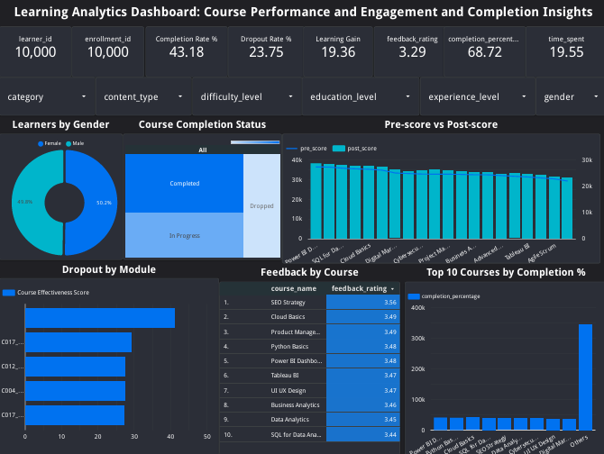

# Learning_Analytics_Dashboard
Learning Analytics Dashboard: Course Performance and Engagement and Completion Insights

Learning Analytics Dashboard built using Google Looker Studio to analyse learner performance, course completion, engagement, assessment outcomes, and feedback metrics. The dashboard provides interactive visualisations and key performance indicators (KPIs) to support data-driven decision-making in learning management systems, helping educators and administrators monitor learner progress, identify dropout patterns, and evaluate course effectiveness.

## Dashboard Preview

Link: https://datastudio.google.com/reporting/f13fbcd5-234f-438d-87c8-4d68cd0322bd
